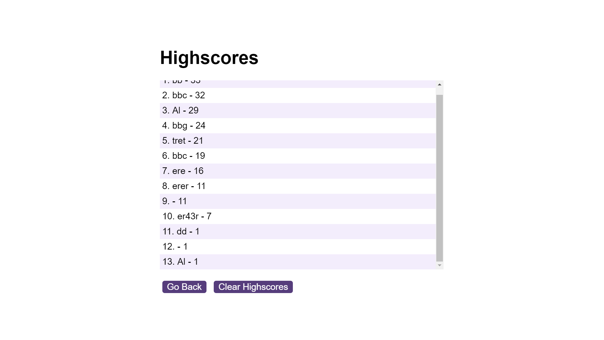

### Coding-Quiz-Challenge

## Description
This is a challenge that make a Quiz application for users to chose answers, it includes time limit and show high score comparison ranking

## User Story
- AS a developer
- I WANT to make a Quiz application for users to choose and show score
- SO THAT users can do some that that want

## Usage:
When user clicked to start button,
the timer starts to count 1 minute, and the questions will be displayed.
user clicked the choice answer button and the correct/ incorrect will show into the bottom
after the quiz finished, user input the initial and turn to highscore page to see the ranking

## Access the application
Application linkage
https://github.com/Louie888A/Coding-Quiz-Challenge

## Screenshots of the application

## License 
MIT License
